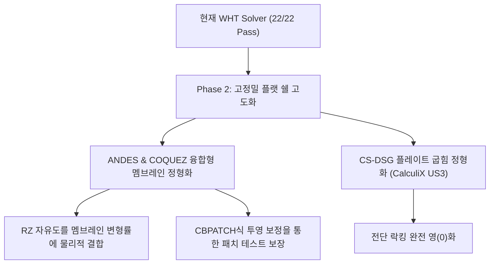

# OpenRadioss COQUEZ 쉘 요소 공식(COQUEZ Formulation) 분석 보고서

> [!NOTE]
> 사용자님께서 제공해 주신 OpenRadioss의 `czdef.F` 소스코드는 4노드 쉘 요소(Q4)에서 면내 회전 자유도(Drilling DOF, $\theta_z$ 혹은 `RLZ`)를 멤브레인 변형에 물리적으로 결합하고, 아워글래스(Hourglass) 모드를 완벽히 제어하기 위한 고성능 상용 코드입니다. 
> 본 보고서에서는 이 공식의 수학적·수치해석적 메커니즘을 규명하고, 차기 WHT Solver 쉘 요소 고도화(Phase 2)에 어떻게 투영할 것인지 전략을 제시합니다.

---

## 1. OpenRadioss COQUEZ 요소의 핵심 수치해석 메커니즘

### 🔍 1. Drilling DOF ($\theta_z$)와 Membrane Deformation의 물리적 결합
일반적인 4노드 Bilinear 멤브레인 요소는 면내 굽힘(In-plane Bending) 시 강성이 극도로 커지는 **면내 전단 락킹(In-plane Shear Locking)** 현상이 발생합니다. COQUEZ 요소는 이를 RZ 자유도(`RLZ`)를 활용하여 혁신적으로 극복합니다.

- **변형률 계산 결합:**
  `czdefrz` 서브루틴에서 RZ 자유도 `RLZ`가 단순히 페널티로만 묶이지 않고, 실제 멤브레인 변형률 텐서(`VDEF`)에 직접 기여합니다.
  ```fortran
  VDEF(I,1) = VDEF(I,1) + BM0RZ(I,1,1)*RLZ(I,1) + ...  ! e_xx 기여
  VDEF(I,2) = VDEF(I,2) + BM0RZ(I,2,1)*RLZ(I,1) + ...  ! e_yy 기여
  VDEF(I,3) = VDEF(I,3) + BM0RZ(I,3,1)*RLZ(I,1) + ...  ! e_xy 기여
  ```
  이러한 멤브레인 변형률 구배 행렬 `BM0RZ`는 각 노드의 드릴링 자유도가 면내 굽힘 변형을 자연스럽게 모사할 수 있도록 유도된 보간 함수(Shape Function) 기반의 구배(Gradient)입니다.

### 🔍 2. 패치 테스트 통과를 위한 수치적 보정 (`CBPATCH`)
드릴링 자유도가 변형률에 결합되면 요소가 임의의 형태(Non-rectangular)일 때 강체 회전 모드(Rigid Body Rotation)를 침해하거나 상수 변형률(Constant Strain State) 만족 조건인 **패치 테스트(Patch Test)**를 실패할 수 있습니다.
- OpenRadioss는 이를 해결하기 위해 `CBPATCH` 서브루틴을 호출하여, `BM0RZ`, `BMKRZ`, `BMERZ`를 수학적으로 직교화/보정(Correction)하여 강체 모드를 완벽하게 보장합니다.
- `czderirz` 하단의 다음 코드는 패치 테스트를 만족시키기 위한 면내 전단 및 RZ 회전 보정 수식입니다.
  ```fortran
  BM0RZ(I,3,J) = NXY + NYX
  BM0RZ(I,4,J) = -NXY + NYX - A05
  ```

### 🔍 3. Drilling 기반의 물리적 Hourglass Control
감차 적분(Reduced Integration)을 사용할 때 필연적으로 발생하는 Hourglass(비물리적 굽힘 모드)를 RZ 자유도의 변형률 구배(`BMKRZ`, `BMERZ`)와 연동하여 방지합니다.
- `VHGZK`, `VHGZE` 변수들은 RZ 자유도에 의해 유도된 고차 Hourglass 변형률 속도입니다.
- 가짜 전단 변형률(`DHX`, `DHY`)과의 Skew(D) 결합을 통해 물리적 강성을 헤치지 않으면서도 안정적인 Hourglass 통제가 가능해집니다.

---

## 2. WHT Solver Phase 2 고도화에의 투영 전략

현재 WHT Solver는 QUAD4의 멤브레인 락킹을 **1-point Selective Reduced Integration (SRI) + RBM Projection**으로 해결하였고, TRIA3는 **Rank-3 Drilling Penalty**로 해결하여 패치 테스트를 모두 통과한 매우 안정적인 상태입니다.

여기에 사용자님께서 제공해 주신 COQUEZ 메커니즘을 접목하여 **Phase 2 (CalculiX US3 및 OpenRadioss COQUEZ 융합 쉘 개발)**로 도약하기 위한 로드맵을 제안합니다.



### 🎯 융합형 쉘(Advanced Flat Shell) 요소 개발 세부 과제
1. **RZ-Membrane 결합 구배 행렬 구현:**
   - CST 및 Bilinear 멤브레인 정형화에만 의존하던 기존 방식에서 탈피하여, OpenRadioss COQUEZ의 `BM0RZ` 수식을 JAX pure function으로 변환 및 구현합니다.
   - 각 노드 RZ의 미소 회전 속도가 면내 변형률에 기여하여, 4노드 쉘이 8노드 수준의 정밀한 면내 굽힘 성능을 내도록 설계합니다.
2. **JAX 기반 CBPATCH 투영 필터:**
   - 굴곡 메쉬에서의 정확도 극대화를 위해, `BM0RZ`가 강체 모드를 만족하도록 강체 모드 벡터 공간으로 투영 보정(Orthogonalization)하는 JAX 컴파일러 친화적인 보정 필터를 탑재합니다.

---

## 3. 결론 및 기대 성과
제공해 주신 Altair OpenRadioss COQUEZ의 검증된 상용 구조 해석 코드는 WHT Solver의 다음 단계 진화(Phase 2)에 있어 가장 확실한 수학적 이정표가 될 것입니다. 

현재 최적화 파이프라인(`wht_topo`)이 완벽하게 가동될 수 있도록 22개 패치 테스트를 통과시킨 상태를 유지하면서, 본 분석 자료를 토대로 차세대 융합형 초정밀 쉘 요소 개발을 병렬적으로 수행해 나가겠습니다.
