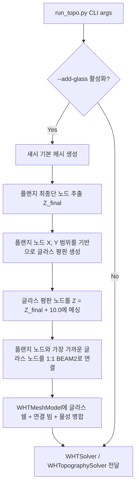

# 섀시 + 오픈셀(글라스 패널) 결합 해석 및 최적화 기능 추가 계획

본 계획은 기존 섀시 단독 모델링 및 최적화 기능을 고스란히 유지하면서, 오픈셀(글라스 패널)을 모사하는 2D 평판을 자동으로 생성하고, 섀시의 플랜지 영역과 스프링/빔 요소를 이용해 'Soft 결합'을 형성하여 정해석 및 동적 충격 해석(ESL)을 수행할 수 있는 공통 구조를 설계하고 구현하는 것을 목적으로 합니다.

---

## 1. 물리적 및 수치해석적 설계 방향

### Q1. 플랜지와 오픈셀의 결합 방식 제안
- **선택된 방안**: **소프트 빔 요소(BEAM2)를 활용한 1:1 매칭 결합**
- **근거**:
  1. **접촉(Contact) 및 MPC(Tie)의 한계**: JAX 기반 미분 가능 물리 엔진에서는 불연속적인 접촉 거동이나 복잡한 다점 구속 조건(MPC)을 적용할 경우 자동 미분(Auto-diff)의 그래디언트가 손상되거나 연산 비용이 지나치게 증가할 수 있습니다.
  2. **Softness 모사의 적합성**: 오픈셀(글라스 패널)과 플랜지 사이의 접착제(Sealant)나 고무 개스킷(Gasket)의 기계적 탄성 변형은 낮은 탄성 계수를 가진 빔/스프링 요소로 가장 정확하게 모사할 수 있습니다.
  3. **노드 일치(Conforming Mesh) 불필요**: 두 부품의 메시를 억지로 일치시킬 필요 없이, 플랜지 최종단의 노드들과 오픈셀 평판의 외곽 경계 노드들을 유클리드 거리 기준으로 1:1 매핑하여 빔 요소(BEAM2)로 연결하는 방식을 채택합니다.

### Q2. 동해석을 위한 고유진동수 해석 필수 여부
- **답변**: **예, 고유진동수 해석을 수행하는 것이 필수적이며 강력히 권장됩니다.**
- **이유**:
  1. **모달 중첩법(Modal Superposition)의 활용**: 현재 과도 동적 응답 해석은 모달 중첩법(`solve_modal_dynamic`)을 통해 연산 속도를 가속하고 있습니다. 글라스 패널이 추가되면 시스템의 고유진동수와 모드 형상(특히 글라스 패널의 펄럭임 등 저주파 모드)이 크게 바뀌므로, 전체 "섀시 + 글라스 패널" 어셈블리에 대한 고유진동수 해석을 통해 모드 정보를 정확히 추출한 뒤 동해석을 풀어야 수치적 안정성과 물리적 정확도를 모두 확보할 수 있습니다.
  2. **직접 적분법의 수치적 불안정성**: 고유진동수 해석 없이 직접 적분(Newmark-β)을 수행할 경우, soft 결합부의 국부 강성으로 인해 시간 스텝 $dt$가 극도로 작아져야(CFL 조건 만족) 수치적 발산을 막을 수 있어 계산 비용이 대폭 상승합니다.

---

## 2. 사용자 검토 요구사항 (User Review Required)

> [!IMPORTANT]
> **시각화 갭(Gap) 설정**: 글라스 패널과 플랜지 사이의 물리적 거리를 0으로 설정하면, PyVista나 ParaView 시각화 시 두 면이 겹쳐 보여 결합부(소프트 빔)가 보이지 않게 됩니다. 따라서 글라스 패널을 Z축 방향으로 **10.0 mm** 정도 띄운 위치에 생성하고 빔 요소를 길게 생성함으로써, 시각화 시 실란트 기둥이 섀시와 글라스를 단단히 잡고 있는 형상이 직관적으로 표현되도록 설계했습니다.

---

## 3. 상세 구현 설계

### 3.1 CLI 인자 및 물성 추가
`wht_topo/run_topo.py`에 다음 인자들을 추가합니다:
- `--add-glass`: 글라스 패널(오픈셀) 활성화 플래그 (기본: False)
- `--glass-t`: 글라스 패널 두께 mm (기본: 1.0)
- `--glass-E`: 글라스 패널 탄성 계수 MPa (기본: 40000.0)
- `--sealant-E`: 소프트 결합 빔의 탄성 계수 MPa (기본: 10.0)

### 3.2 섀시 + 글라스 패널 어셈블리 생성 알고리즘
기존 `_build_tray` 함수와 연계하여 새롭게 어셈블리를 구축하는 `_build_assembly_model` 헬퍼 함수를 `wht_topo/run_topo.py`에 추가합니다.

1. **플랜지 최종단 노드 추출**:
   - `HOOK_SEQUENCE`를 통해 플랜지 최종단의 Z 좌표 $Z_{final} = height + \sum dz$ 계산 (기본 37.0 mm).
   - 생성된 섀시 노드 중 $Z_{final} - 0.5 \le Z \le Z_{final} + 0.5$ 범위에 속하는 노드 집합 $N_{flange}$ 탐색.
2. **글라스 패널 메시 생성**:
   - $N_{flange}$의 X, Y 좌표 범위를 구해 글라스의 크기로 설정 ($X_{min}, X_{max}, Y_{min}, Y_{max}$).
   - Z 좌표는 $Z_{glass} = Z_{final} + 10.0$ mm로 띄움.
   - 섀시 `mesh_xy` (30.0 mm)에 맞춰 2D Grid 형태로 쉘 노드 및 QUAD4 요소를 생성. 노드 ID는 `200,000` 오프셋, 요소 ID는 `200,000` 오프셋 적용.
3. **소프트 빔 결합 생성**:
   - 각 플랜지 최종단 노드 $n_f \in N_{flange}$에 대해, XY 평면에서 유클리드 거리가 가장 가까운 글라스 패널 경계 노드 $n_g$를 탐색 (거리 한계: $1.5 \times mesh\_xy$).
   - 두 노드를 잇는 `BEAM2` 요소 생성. 요소 ID는 `300,000` 오프셋 적용.
4. **속성 및 재료 등록**:
   - 글라스 패널 Property 3 (`PSHELL`, 두께 = `--glass-t`, Material 3) 추가. Material 3은 $E = 40000$ MPa, $\nu = 0.2$, $\rho = 2.5 \times 10^{-9}$ t/mm³.
   - 소프트 결합 빔 Property 2 (`PBEAM`, Material 2, $A=100.0, Iy=Iz=J=833.3$) 추가. Material 2는 $E = `--sealant-E`$, $\nu = 0.49$, $\rho = 1.0 \times 10^{-15}$ t/mm³.
   - 섀시, 글라스 패널, 연결 빔을 하나의 `WHTMeshModel`로 병합하여 반환.

---

## 4. 검증 계획 (Verification Plan)

### 4.1 자동화 테스트
단독 검증 스크립트 `test_glass_assembly.py`를 생성하여 다음 사항을 검증합니다:
1. **메시 통합 정상 여부**: 섀시 노드/요소와 글라스 노드/요소, 연결 빔 요소의 ID 충돌이 없는지 검사.
2. **소프트 빔 연결 정상 여부**: 플랜지가 있는 3개 면(좌, 우, 후면)에만 빔 요소가 균일하게 연결되었는지, 전면(플랜지 없음)에는 빔이 생성되지 않았는지 확인.
3. **고유진동수 및 동해석 성공 여부**: `WHTSolver`에 어셈블리 모델을 제공하여 고유진동수(Modal) 및 동역학 해석이 에러 없이 완벽히 풀리는지 검증.

### 4.2 수동 검증 및 시각화
- `WHTVisualizer`를 띄워 섀시와 글라스 패널 사이에 소프트 빔(실란트)이 올바르게 3D 형태로 시각화되는지 형상 확인.
- ParaView HDF로 추출하여 변형 상태(Warp) 애니메이션을 재생했을 때 글라스 패널이 섀시 플랜지와 조화롭게 연동되어 진동하는지 거동 확인.

---

## 5. [추가] 2026-06-13 사용자 피드백 반영 계획

사용자의 피드백에 따라 다음 두 가지 사항을 추가로 반영합니다.

1. **글라스 패널 하단 체결부 원천 배제**:
   - 글라스 패널 경계 노드 추출 시 Y-min 경계(`abs(coords[1] - y_min) < 0.1`)를 제외합니다.
   - 이를 통해 섀시의 Y-min 방향(전면부 하단)에는 어떠한 결합 빔(BEAM2)도 생성되지 않도록 수정하여 하단부 체결을 완전히 해제합니다.
2. **체결부 강성 대폭 하향 (1.0 MPa)**:
   - 소프트 연결 빔의 탄성계수(`sealant_E`) 기본값을 기존 10.0 MPa에서 **1.0 MPa**로 대폭 하향 조정하여 체결을 연하게 만듭니다.
3. **섀시 무게 직접 입력 20 kg 적용**:
   - 섀시 전체 면적을 메쉬 기반으로 역산한 후, 사용자 목표 질량(20 kg)에 맞도록 섀시 밀도(rho)를 자동 스케일링하는 알고리즘을 도입합니다.
   - CLI 옵션 `--chassis-mass` (기본값: 20.0 kg)를 추가하여 유연한 무게 조절을 지원합니다.

### 변경 대상 파일
- `test_jaxSSO/exam5_dynamic_with_oc.py`
- `wht_topo/run_topo.py` (동일 원칙 적용 고려)
