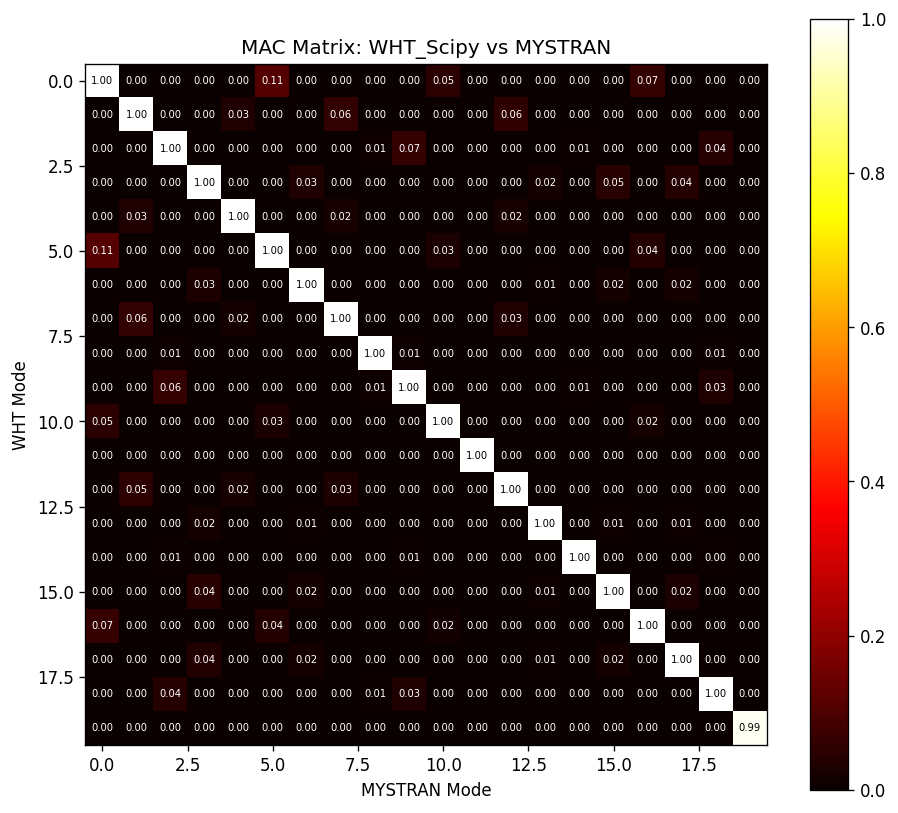

# JAX SSO Multi-Agent Benchmark Report

## 1. 수행 시간 비교 (단위: 초)

| Solver | Modal | Static(bending) | Static(twisting) | Static(bending_xspan) | Static(bending_yspan) | Static(twisting_alt) | Static(lifting_c0) | Static(lifting_c1) | Static(lifting_c2) | Static(lifting_c3) |
|---|---|---|---|---|---|---|---|---|---|---|
| WHT_Scipy | 4.954 | 0.911 | 1.100 | 0.890 | 0.924 | 1.021 | 0.963 | 0.942 | 0.901 | 0.933 |
| WHT_Pardiso | 5.911 | 2.506 | 0.364 | 0.321 | 0.344 | 0.346 | 0.339 | 0.357 | 0.335 | 0.351 |
| CalculiX | 113.931 | 2.061 | 1.813 | 1.888 | 1.961 | 1.896 | 1.871 | 1.932 | 1.846 | 2.013 |
| MYSTRAN | 4.627 | 2.308 | 2.397 | 2.408 | 2.366 | 2.358 | 2.390 | 2.388 | 2.328 | 2.382 |

## 2. 정해석 결과 — Max Displacement [mm]

| Solver | bending | twisting | bending_xspan | bending_yspan | twisting_alt | lifting_c0 | lifting_c1 | lifting_c2 | lifting_c3 |
|---|---|---|---|---|---|---|---|---|---|
| WHT_Scipy | 4.5451e+02 | 3.4358e+03 | 3.3162e+03 | 2.2008e+03 | 3.4358e+03 | 2.1146e+03 | 2.1146e+03 | 2.1146e+03 | 2.1146e+03 |
| WHT_Pardiso | 4.5451e+02 | 3.4358e+03 | 3.3162e+03 | 2.2008e+03 | 3.4358e+03 | 2.1146e+03 | 2.1146e+03 | 2.1146e+03 | 2.1146e+03 |
| CalculiX | 5.8187e-02 | 6.9302e+01 | 2.0889e-01 | 5.0239e+00 | 7.9043e+01 | 2.7078e+01 | 5.9292e+01 | 3.1295e+01 | 2.4435e+01 |
| MYSTRAN | 4.5451e+02 | 3.7251e+03 | 3.3162e+03 | 2.2008e+03 | 3.7251e+03 | 2.3929e+03 | 2.3929e+03 | 2.3929e+03 | 2.3929e+03 |

## 2. 정해석 결과 — Max Von-Mises [MPa]

| Solver | bending | twisting | bending_xspan | bending_yspan | twisting_alt | lifting_c0 | lifting_c1 | lifting_c2 | lifting_c3 |
|---|---|---|---|---|---|---|---|---|---|
| WHT_Scipy | 460.41 | 22616.02 | 2144.26 | 1829.05 | 22616.02 | 14392.15 | 14392.15 | 14392.15 | 14392.15 |
| WHT_Pardiso | 460.41 | 22616.02 | 2144.26 | 1829.05 | 22616.02 | 14392.15 | 14392.15 | 14392.15 | 14392.15 |
| CalculiX | 2.75 | 4843.34 | 8.59 | 49.21 | 4044.60 | 2235.85 | 1842.46 | 1720.60 | 1641.08 |
| MYSTRAN | 452.05 | 24880.50 | 2155.76 | 1840.49 | 24880.50 | 16352.80 | 16352.80 | 16352.80 | 16352.80 |

## 2. 정해석 결과 — P95 Von-Mises [MPa]

| Solver | bending | twisting | bending_xspan | bending_yspan | twisting_alt | lifting_c0 | lifting_c1 | lifting_c2 | lifting_c3 |
|---|---|---|---|---|---|---|---|---|---|
| WHT_Scipy | 320.89 | 7899.91 | 1382.96 | 1306.13 | 7899.91 | 2927.63 | 2927.63 | 2927.63 | 2927.63 |
| WHT_Pardiso | 320.89 | 7899.91 | 1382.96 | 1306.13 | 7899.91 | 2927.63 | 2927.63 | 2927.63 | 2927.63 |
| CalculiX | 0.82 | 1401.61 | 1.37 | 18.67 | 1480.08 | 694.71 | 388.83 | 433.40 | 316.97 |
| MYSTRAN | 321.68 | 8903.53 | 1381.65 | 1307.27 | 8903.53 | 3408.51 | 3408.51 | 3408.51 | 3408.51 |

## 2. 정해석 결과 — Median Von-Mises [MPa]

| Solver | bending | twisting | bending_xspan | bending_yspan | twisting_alt | lifting_c0 | lifting_c1 | lifting_c2 | lifting_c3 |
|---|---|---|---|---|---|---|---|---|---|
| WHT_Scipy | 135.30 | 341.63 | 732.80 | 488.88 | 341.63 | 126.21 | 126.21 | 126.21 | 126.21 |
| WHT_Pardiso | 135.30 | 341.63 | 732.80 | 488.88 | 341.63 | 126.21 | 126.21 | 126.21 | 126.21 |
| CalculiX | 0.20 | 76.76 | 0.11 | 1.89 | 86.33 | 25.52 | 16.16 | 11.56 | 9.02 |
| MYSTRAN | 140.78 | 489.75 | 730.03 | 485.35 | 489.75 | 194.87 | 194.87 | 194.87 | 194.87 |

## 2. 정해석 결과 — Mean Von-Mises [MPa]

| Solver | bending | twisting | bending_xspan | bending_yspan | twisting_alt | lifting_c0 | lifting_c1 | lifting_c2 | lifting_c3 |
|---|---|---|---|---|---|---|---|---|---|
| WHT_Scipy | 141.93 | 1468.96 | 737.29 | 548.87 | 1468.96 | 513.32 | 513.32 | 513.32 | 513.32 |
| WHT_Pardiso | 141.93 | 1468.96 | 737.29 | 548.87 | 1468.96 | 513.32 | 513.32 | 513.32 | 513.32 |
| CalculiX | 0.29 | 298.06 | 0.31 | 4.42 | 304.97 | 148.80 | 74.30 | 79.37 | 63.15 |
| MYSTRAN | 152.30 | 1682.64 | 735.92 | 549.08 | 1682.64 | 639.14 | 639.14 | 639.14 | 639.14 |

## 2. 정해석 결과 — Std Von-Mises [MPa]

| Solver | bending | twisting | bending_xspan | bending_yspan | twisting_alt | lifting_c0 | lifting_c1 | lifting_c2 | lifting_c3 |
|---|---|---|---|---|---|---|---|---|---|
| WHT_Scipy | 88.60 | 2947.29 | 348.34 | 352.39 | 2947.29 | 1424.82 | 1424.82 | 1424.82 | 1424.82 |
| WHT_Pardiso | 88.60 | 2947.29 | 348.34 | 352.39 | 2947.29 | 1424.82 | 1424.82 | 1424.82 | 1424.82 |
| CalculiX | 0.29 | 522.24 | 0.62 | 6.40 | 527.73 | 276.09 | 164.76 | 179.92 | 148.02 |
| MYSTRAN | 81.93 | 3335.23 | 350.20 | 352.30 | 3335.23 | 1643.56 | 1643.56 | 1643.56 | 1643.56 |

## 3. 모달 결과 (Frequencies [Hz])

| Mode | WHT_Scipy | WHT_Pardiso | CalculiX | MYSTRAN |
|---|---|---|---|---|
| **Time (s)** | 4.954 | 5.911 | 113.931 | 4.627 |
| 1 | 0.818 | 0.818 | 0.826 | 0.818 |
| 2 | 2.008 | 2.008 | 2.231 | 2.012 |
| 3 | 3.472 | 3.472 | 4.221 | 3.482 |
| 4 | 4.721 | 4.721 | 5.466 | 4.739 |
| 5 | 5.288 | 5.289 | 6.379 | 5.303 |
| 6 | 6.002 | 6.002 | 8.266 | 6.029 |
| 7 | 7.673 | 7.673 | 9.760 | 7.709 |
| 8 | 8.419 | 8.419 | 11.000 | 8.456 |
| 9 | 8.492 | 8.492 | 11.447 | 8.534 |
| 10 | 9.990 | 9.992 | 14.713 | 10.064 |
| 11 | 11.099 | 11.099 | 15.789 | 11.178 |
| 12 | 11.408 | 11.408 | 17.187 | 11.483 |
| 13 | 12.741 | 12.741 | 18.393 | 12.831 |
| 14 | 13.792 | 13.792 | 19.244 | 13.880 |
| 15 | 14.697 | 14.697 | 21.240 | 14.826 |
| 16 | 15.366 | 15.366 | 22.634 | 15.525 |
| 17 | 15.486 | 15.486 | 23.461 | 15.645 |
| 18 | 17.280 | 17.280 | 24.018 | 17.471 |
| 19 | 18.122 | 18.122 | 28.035 | 18.326 |
| 20 | 18.350 | 18.350 | 28.295 | 18.439 |

## 4. MAC (Modal Assurance Criterion) - WHT_Scipy vs MYSTRAN

| | 대각선 평균 MAC | 최소 대각 MAC |
|--|---|---|
| WHT_Scipy vs MYSTRAN | 0.9993 | 0.9865 |

| Mode | MAC |
|---|---|
| 1 | 1.0000 |
| 2 | 1.0000 |
| 3 | 1.0000 |
| 4 | 1.0000 |
| 5 | 1.0000 |
| 6 | 1.0000 |
| 7 | 1.0000 |
| 8 | 0.9999 |
| 9 | 1.0000 |
| 10 | 1.0000 |
| 11 | 1.0000 |
| 12 | 1.0000 |
| 13 | 0.9997 |
| 14 | 0.9998 |
| 15 | 1.0000 |
| 16 | 0.9999 |
| 17 | 1.0000 |
| 18 | 0.9997 |
| 19 | 0.9999 |
| 20 | 0.9865 |
